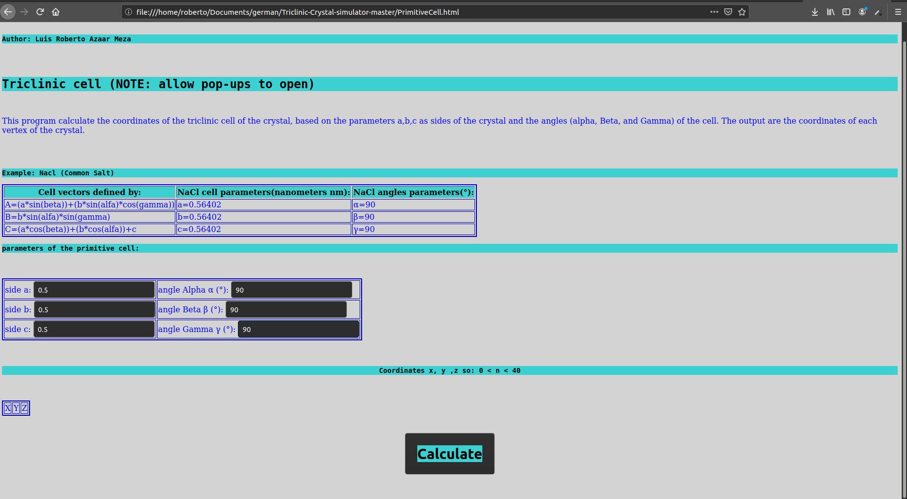
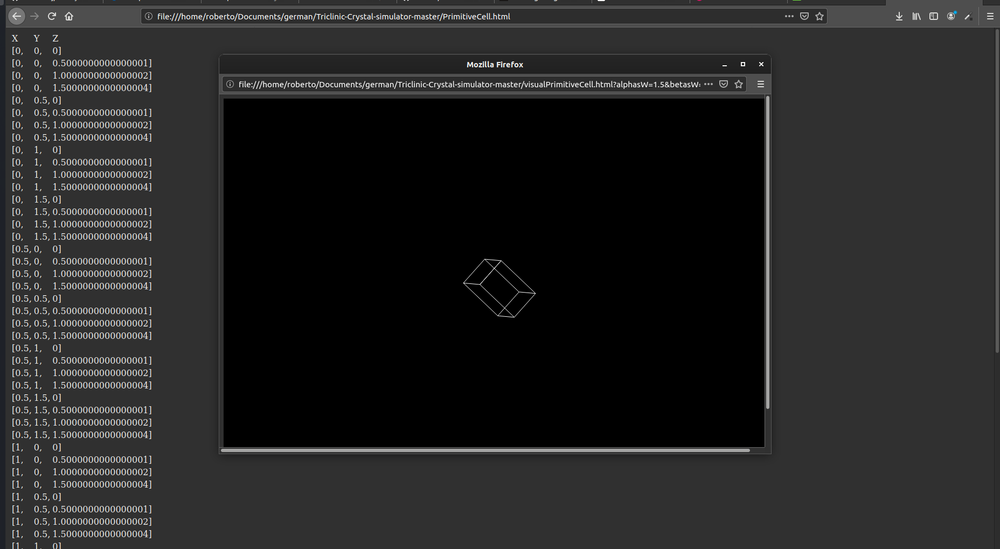

  <h1>Triclinic Crystal simulator</h1>

## Documentation

Triclinic Crystal simulator is a program that show you the coordinate of the atomic positions of the elemental crystal systems. 
>Control Panel

>3D View

### Running locally

1. Download the files.
2. Double click on file PrimitiveCell.html
3. Write the sides (a,b,c ) and the angles (alpha, beta and gamma) of the elemental cell. 
4. Click on "calculate"

## Creators

**Luis Roberto Azaar Meza**

- <luisro5azaar@gmail.com>
- <https://github.com/luisro5>

## Copyright and license

This program is free software: you can redistribute it and/or modify
    it under the terms of the GNU General Public License as published by
    the Free Software Foundation, either version 3 of the License, or
    (at your option) any later version.

    This program is distributed in the hope that it will be useful,
    but WITHOUT ANY WARRANTY; without even the implied warranty of
    MERCHANTABILITY or FITNESS FOR A PARTICULAR PURPOSE.  See the
    GNU General Public License for more details.

    You should have received a copy of the GNU General Public License
    along with this program.  If not, see <https://www.gnu.org/licenses/>.
